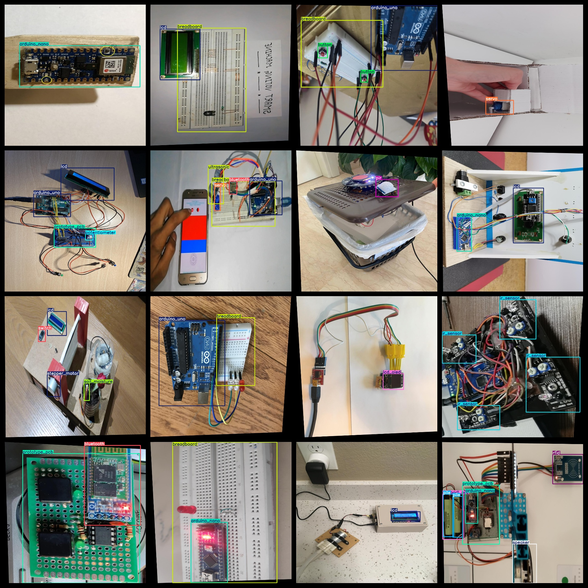
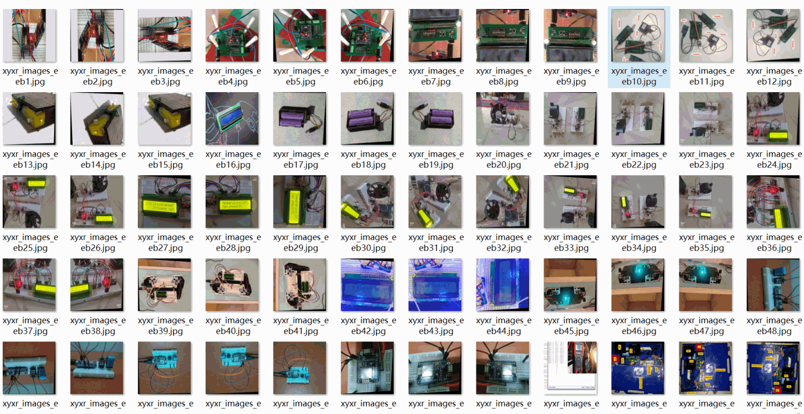

# [Object Detection] Electric Subcomponents Detection Dataset 9185 imagesYOLO+VOC format

Dataset Format: VOC format + YOLO format

The compressed file contains: three folders, each storing images, xml files, and text files.

Total jpg images in JPEGImages folder: 9185

The total number of xml files in the Annotations folder is: 9185.

The total number of txt files in the labels folder is 9185.

Number of tag types: 48

Tag names: ["7_seg","arduino_mega","arduino_mini","arduino_nano","arduino_uno","battery_9v","bluetooth","breadboard","button","buzzer","capacitor","dc_motor","dht","display","esp32","esp_wifi","fan","flame_sensor","gaz","h_bridge","ir_receiver","ir_sensor","joystick","keypad","lcd","lcd_oled","ldr","led_matrix","lilypad","lipo","pile","pir","potentiometer","power_module","prototype_pcb","relai","rfid","rtc","servo","soil_moisture","solar_panel","sound","speaker","stepper_driver","stepper_motor","support_pile","switch","ultrasonic"]

The number of boxes for each label (Note that the order of labels in the Yolo format does not correspond to this, but is based on the classes.txt file in the labels folder):

7_seg frame count = 638

arduino_mega frame count = 420

arduino_mini frame count = 308

arduino_nano frame count = 1552

arduino_uno frame count = 2536

battery_9v frame count = 495

bluetooth frame count = 626

breadboard frame count = 4111

button frame count = 2025

buzzer frame count = 624

capacitor frame count = 710

dc_motor frame count = 869

dht frame count = 338

display frame count = 117

esp32 frame count = 187

esp_wifi frame count = 185

fan frame count = 149

flame_sensor frame count = 78

gaz frame count = 73

h_bridge frame count = 522

ir_receiver frame count = 119

ir_sensor frame count = 358

joystick frame count = 163

keypad frame count = 107

lcd frame count = 1499

lcd_oled frame count = 430

ldr frame count = 350

led_matrix frame count = 345

lilypad frame count = 71

lipo frame count = 174

pile frame count = 738

pir frame count = 129

potentiometer frame count = 764

power_module frame count = 109

prototype_pcb frame count = 1342

relai frame count = 1855

rfid frame count = 83

rtc frame count = 433

servo frame count = 2082

soil_moisture frame count = 83

solar_panel frame count = 116

sound frame count = 87

speaker frame count = 197

stepper_driver frame count = 157

stepper_motor frame count = 231

support_pile frame count = 252

switch frame count = 456

ultrasonic frame count = 1085

Total boxes: 30378

Picture clarity (Resolution: Pixels): Clear

Image Enhancement: Yes

Shape of the label: Rectangular box, used for object detection and recognition.

Dataset Type ：149m

Special Notice: This dataset does not guarantee the accuracy or precision of the trained models or weight files. The dataset only provides accurate and reasonable annotations.

Annotation examples or image overview:

## Images

---

Here is a pay link on Stripe (https://buy.stripe.com/3cs8yP7sY87d0vu9AB). Please contact me lonlonago@foxmail.com after funding $89, and I will send you a complete data files, thank you!

